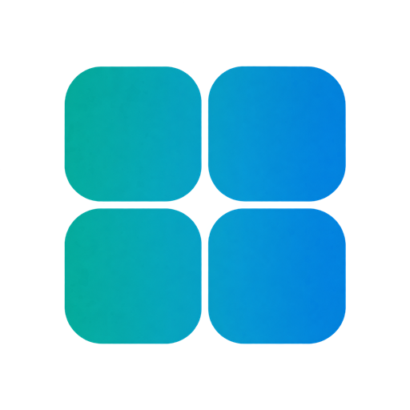
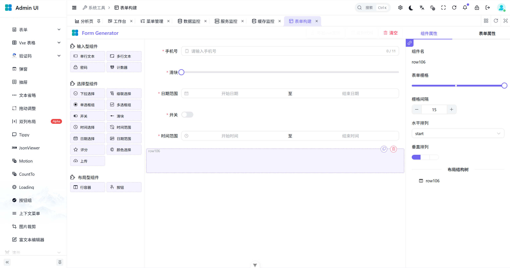

<div align="center">
  <a href="https://admin.geoearth.dev">
    
  </a>
  <br>
  <a href="./LICENSE">
    
  </a>
  <h1 align="center">Admin Platform</h1>
  <strong>A modern admin platform for building business applications</strong>
  <p align="center"> Separate frontend and backend · Modular architecture · Consistent admin experience </p>
</div>

<p align="center">
  <a href="./pom.xml"></a>
  <a href="./pom.xml"></a>
  <a href="./admin-ui/package.json"></a>
  <a href="./admin-ui/package.json"></a>
  <a href="https://github.com/geoearth-dev/admin-platform/actions/workflows/deploy.yml"></a>
</p>

<p align="center">
  <a href="https://admin.geoearth.dev">Home</a>
  &nbsp;·&nbsp;
  <a href="https://admin-demo.geoearth.dev">Live Demo</a>
  &nbsp;·&nbsp;
  <a href="#preview">Preview</a>
  &nbsp;·&nbsp;
  <a href="#quick-start">Quick Start</a>
  &nbsp;·&nbsp;
  <a href="https://github.com/geoearth-dev/admin-platform/issues">Issues</a>
</p>

<p align="center">
  <strong>English</strong> · <a href="./README.zh-CN.md">简体中文</a>
</p>

---

## Overview

**Admin Platform** is an admin platform built with **Spring Boot, Vue 3, and TypeScript**, with separate frontend and backend applications. It provides a reusable foundation for business systems, including user and role management, menu permissions, system configuration, online sessions, task scheduling, and code generation.

The backend uses Maven modules to organize business features and shared capabilities. The frontend separates API calls, routing, state, preferences, and components. The goal is to reduce repetitive setup so developers can focus on their business applications.

## Preview

<table>
  <tr>
    <td><a href="./admin-docs/public/images/analysis.png"></a></td>
    <td><a href="./admin-docs/public/images/workbench.png"></a></td>
  </tr>
</table>

## Features

| Module | Capabilities |
| --- | --- |
| **System management** | Users, roles, menu permissions, and system configuration |
| **Authentication and sessions** | Authentication, access control, and online session management |
| **Task scheduling** | Scheduled task management and execution |
| **Code generation** | Table and field configuration, generation options, and template-based code generation |
| **Shared backend modules** | Utilities, security, data access, Redis, and Excel support |
| **Frontend foundation** | Forms, modals, tabs, theme preferences, and internationalization |

## Tech Stack

| Layer | Technologies |
| --- | --- |
| Backend | Java 17, Spring Boot 4, Maven |
| Data access | MyBatis-Plus, Druid |
| Data storage | MySQL, Redis |
| API documentation | SpringDoc OpenAPI |
| Utilities and templates | Hutool, Lombok, Apache POI, Apache Velocity |
| Frontend | Vue 3, TypeScript 6, Vite 8 |
| UI and styling | Element Plus, Tailwind CSS, Vben components |
| State and routing | Pinia, Vue Router |
| Charts and internationalization | ECharts, Vue I18n |

See [pom.xml](./pom.xml) and the frontend [package.json](./admin-ui/package.json) for exact dependency versions.

## Project Structure

```text
admin-platform/
├── admin-server/                 # Backend entry point, runtime and logging configuration
├── admin-module-system/          # System management, authentication, monitoring, and messaging
├── admin-framework/              # Shared backend modules
│   ├── admin-common/             # Common utilities
│   ├── admin-config/             # Configuration
│   ├── admin-security/           # Security
│   ├── admin-mybatis/            # Data access
│   ├── admin-redis/              # Redis support
│   ├── admin-websocket/          # WebSocket support
│   ├── admin-excel/              # Excel processing
│   ├── admin-quartz/             # Task scheduling
│   └── admin-generator/          # Code generation
├── admin-ui/                     # Vue frontend
├── sql/                          # Database initialization snapshot
├── admin-docs/                   # Website, documentation, and shared images in public/images
├── pom.xml                       # Maven aggregation and dependency management
└── README.md
```

See [admin-ui/README.md](./admin-ui/README.md) for the frontend structure and component documentation.

## Quick Start

### 1. Prerequisites

| Environment | Requirement |
| --- | --- |
| JDK | 17 or later; the project targets Java 17 |
| Maven | 3.9 or later |
| Node.js | `^22.18.0 \|\| >=24.12.0` |
| MySQL / Redis | Running instances with development connection details available |

The Node.js requirement is defined in the `engines` field of [package.json](./admin-ui/package.json).

### 2. Clone the Repository

```bash
git clone https://github.com/geoearth-dev/admin-platform.git
cd admin-platform
```

### 3. Initialize the Database and Configure Connections

Import [sql/demo-baseline.sql](./sql/demo-baseline.sql) into a dedicated development or demo database, then configure the database, Redis, file storage, and other settings in [application-dev.yml](./admin-server/src/main/resources/application-dev.yml).

Shared settings are in [application.yml](./admin-server/src/main/resources/application.yml); production settings are in [application-prod.yml](./admin-server/src/main/resources/application-prod.yml).

### 4. Start the Backend

Run from the repository root:

```bash
mvn clean package
java -jar admin-server/target/admin-server-0.1.0-SNAPSHOT.jar --spring.profiles.active=dev
```

The backend uses port `8080` by default. If the project version changes, use the actual JAR filename generated under `admin-server/target`.

In IntelliJ IDEA, you can also run the main class in `admin-server` with the `dev` profile enabled.

### 5. Start the Frontend

Open another terminal at the repository root:

```bash
cd admin-ui
npm install
npm run dev
```

<details>
<summary><strong>Frontend Development Commands</strong></summary>

Run these commands in `admin-ui`. Available scripts are defined in [package.json](./admin-ui/package.json).

| Command | Purpose |
| --- | --- |
| `npm run dev` | Start the development server |
| `npm run type-check` | Run TypeScript and Vue type checks |
| `npm run build` | Run type checks and build |
| `npm run build-only` | Build without a separate type check |
| `npm run preview` | Preview the build locally |
| `npm run format` | Format files under `src`, modifying them in place |

</details>

## Documentation and Contributing

See the [project documentation](https://admin-docs.geoearth.dev) and [frontend README](./admin-ui/README.md) for further development details.

[Issues](https://github.com/geoearth-dev/admin-platform/issues) and [pull requests](https://github.com/geoearth-dev/admin-platform/pulls) are welcome. For bug reports, include your environment, reproduction steps, and relevant logs. For code changes, describe the purpose and how you verified them.

## Acknowledgments

Thanks to [RuoYi](https://github.com/yangzongzhuan/RuoYi-Vue) and [Vue Vben Admin](https://github.com/vbenjs/vue-vben-admin) for implementation references and component foundations, and to all open-source dependencies and their contributors.

## License

This project is licensed under the [MIT License](./LICENSE). See `LICENSE` for the full terms.

---

<p align="center">
  <sub>Admin Platform · Build the foundation. Focus on your business.</sub>
</p>
