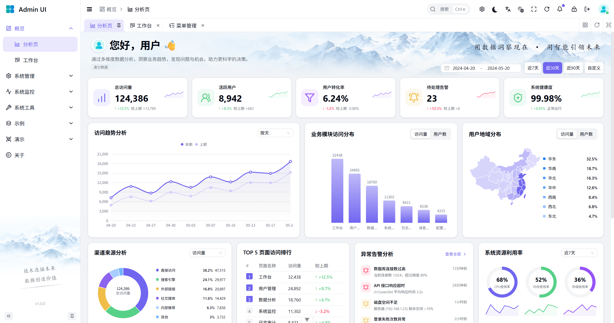

<div align="center">
  <a href="https://admin.geoearth.dev">
    
  </a>
  <br>
  <a href="./LICENSE">
    
  </a>
  <h1 align="center">Admin Platform</h1>
  <strong>一个以业务开发为中心的现代化管理平台</strong>
  <p align="center"> 前后端分离 · 模块化组织 · 统一管理体验 </p>
</div>

<p align="center">
  <a href="./pom.xml"></a>
  <a href="./pom.xml"></a>
  <a href="./admin-ui/package.json"></a>
  <a href="./admin-ui/package.json"></a>
  <a href="https://github.com/geoearth-dev/admin-platform/actions/workflows/deploy.yml"></a>
</p>

<p align="center">
  <a href="https://admin.geoearth.dev">项目主页</a>
  &nbsp;·&nbsp;
  <a href="https://admin-docs.geoearth.dev">项目文档</a>
  &nbsp;·&nbsp;
  <a href="https://admin-demo.geoearth.dev">在线演示</a>
  &nbsp;·&nbsp;
  <a href="#界面预览">界面预览</a>
  &nbsp;·&nbsp;
  <a href="#快速开始">快速开始</a>
  &nbsp;·&nbsp;
  <a href="https://github.com/geoearth-dev/admin-platform/issues">问题反馈</a>
</p>

<p align="center">
  <a href="./README.md">English</a> · <strong>简体中文</strong>
</p>

---

## 项目介绍

**Admin Platform** 是基于 **Spring Boot、Vue 3 和 TypeScript**
的前后端分离管理平台，围绕用户与角色管理、菜单权限、系统配置、在线会话、任务调度和代码生成等能力，为业务系统开发提供可复用的工程基础。

后端通过 Maven 多模块组织业务与公共能力；前端按接口、路由、状态、偏好设置和组件划分职责。项目希望减少重复建设，让开发者把更多精力放在业务本身。

## 界面预览

<table>
  <tr>
    <td><a href="./docs/readme/analysis.png"></a></td>
    <td><a href="./docs/readme/workbench.png"></a></td>
  </tr>
</table>

## 功能模块

| 模块        | 内容                             |
|:----------|:-------------------------------|
| **系统管理**  | 用户与角色管理、菜单权限、系统配置              |
| **认证与会话** | 身份认证、访问控制、在线会话管理               |
| **任务调度**  | 定时任务管理与调度基础能力                  |
| **代码生成**  | 表与字段配置、生成选项、模板驱动的代码生成          |
| **公共基础**  | 通用工具、安全、数据访问、Redis、Excel 等基础模块 |
| **前端基础**  | 表单、弹窗、标签页等组件，以及主题偏好和国际化配置      |

## 技术栈

| 层级     | 技术选型                                     |
|:-------|:-----------------------------------------|
| 后端基础   | Java 17、Spring Boot 4、Maven              |
| 数据访问   | MyBatis-Plus、Druid                       |
| 数据存储   | MySQL、Redis                              |
| 接口文档   | SpringDoc OpenAPI                        |
| 工具与模板  | Hutool、Lombok、Apache POI、Apache Velocity |
| 前端基础   | Vue 3、TypeScript 6、Vite 8                |
| 界面与样式  | Element Plus、Tailwind CSS、Vben 组件        |
| 状态与路由  | Pinia、Vue Router                         |
| 图表与国际化 | ECharts、Vue I18n                         |

具体依赖版本以根目录的 [pom.xml](./pom.xml) 和前端的 [package.json](./admin-ui/package.json) 为准。

## 工程结构

```text
admin-platform/
├── admin-server/                 # 后端启动模块、运行配置与日志配置
├── admin-module-system/          # 系统管理、认证、监控与消息等业务
├── admin-framework/              # 后端公共能力
│   ├── admin-common/             # 通用工具
│   ├── admin-config/             # 配置模块
│   ├── admin-security/           # 安全模块
│   ├── admin-mybatis/            # 数据访问
│   ├── admin-redis/              # Redis 基础模块
│   ├── admin-websocket/          # WebSocket 基础模块
│   ├── admin-excel/              # Excel 处理
│   ├── admin-quartz/             # 任务调度
│   └── admin-generator/          # 代码生成
├── admin-ui/                     # Vue 前端
├── sql/                          # 数据库初始化快照
├── docs/readme/                  # README 预览图片
├── pom.xml                       # Maven 聚合与依赖管理
└── README.md
```

前端目录和组件使用说明见 [admin-ui/README.zh-CN.md](./admin-ui/README.zh-CN.md)。

## 快速开始

### 1. 准备开发环境

| 环境            | 要求                           |
|:--------------|:-----------------------------|
| JDK           | 17 或以上版本，项目编译目标为 17          |
| Maven         | 3.9 或以上版本                    |
| Node.js       | 满足 `^22.18.0 \|\| >=24.12.0` |
| MySQL / Redis | 已启动，并准备好开发环境连接信息             |

Node.js 版本约束以 [package.json](./admin-ui/package.json) 的 `engines` 为准。

### 2. 获取源码

```bash
git clone https://github.com/geoearth-dev/admin-platform.git
cd admin-platform
```

### 3. 初始化数据库并配置连接

在独立的开发或演示数据库中导入 [sql/demo-baseline.sql](./sql/demo-baseline.sql)
，然后调整 [application-dev.yml](./admin-server/src/main/resources/application-dev.yml) 中的数据库、Redis、文件存储等配置。

公共配置位于 [application.yml](./admin-server/src/main/resources/application.yml)
，生产环境配置位于 [application-prod.yml](./admin-server/src/main/resources/application-prod.yml)。

### 4. 启动后端

在仓库根目录执行：

```bash
mvn clean package
java -jar admin-server/target/admin-server-0.1.0-SNAPSHOT.jar --spring.profiles.active=dev
```

后端默认端口为 `8080`。项目版本变化后，请使用 `admin-server/target` 下实际生成的 JAR 文件名。

使用 IntelliJ IDEA 开发时，也可以运行 `admin-server` 模块的启动类，并在启动配置中激活 `dev` Profile。

### 5. 启动前端

另开一个终端，在仓库根目录执行：

```bash
cd admin-ui
npm install
npm run dev
```

<details>
<summary><strong>展开：前端常用开发命令</strong></summary>

以下命令均在 `admin-ui` 目录执行，以当前 [package.json](./admin-ui/package.json) 的 `scripts` 为准。

| 命令                   | 用途                       |
|:---------------------|:-------------------------|
| `npm run dev`        | 启动开发服务                   |
| `npm run type-check` | 执行 TypeScript / Vue 类型检查 |
| `npm run build`      | 执行类型检查并构建                |
| `npm run build-only` | 仅构建，不单独执行类型检查            |
| `npm run preview`    | 本地预览构建产物                 |
| `npm run format`     | 格式化 `src` 下的文件，会改写文件     |

</details>

## 文档与参与

开发说明可从 [项目文档](https://admin-docs.geoearth.dev) 和 [前端 README](./admin-ui/README.zh-CN.md) 继续阅读。

欢迎通过 [Issues](https://github.com/geoearth-dev/admin-platform/issues)
反馈问题或提出建议，也欢迎提交 [Pull Request](https://github.com/geoearth-dev/admin-platform/pulls)
。反馈问题时，请附上运行环境、复现步骤以及必要的日志；提交代码时，请说明修改目的与验证方式。

## 致谢

感谢 [RuoYi](https://github.com/yangzongzhuan/RuoYi-Vue) 与 [Vue Vben Admin](https://github.com/vbenjs/vue-vben-admin)
等开源项目提供的实现参考与组件基础，也感谢本项目使用的所有开源依赖及其贡献者。

## 许可证

本项目采用 [MIT License](./LICENSE)。具体授权条款以仓库中的 `LICENSE` 文件为准。

---

<p align="center">
  <sub>Admin Platform · 把基础做好，把精力留给业务。</sub>
</p>
